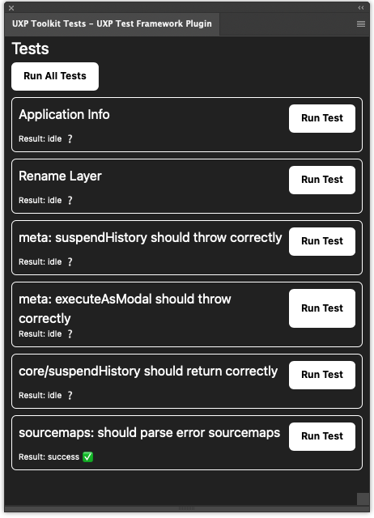

# UXP Toolkit

This is a toolkit for building UXP extensions for Adobe Photoshop. It has been created because the experience building extensions for Adobe Photoshop is pretty terrible. Nothing works as expected and the documentation is lacking.

With the code in this repo, we fix a few things:
- A large amount of functions, including automated tests, for common actions in Photoshop, like interacting with layers and files. 
- A way to interact with batchPlay in a typesafe way, with Zod schemas for the output.
- A unified way to represent layers in your code, without using document.layers (which gets very slow, see below)
- A testing framework for UXP, which you can also use for your own tests.


```bash
pnpm add @bubblydoo/uxp-toolkit
```

## What is wrong with UXP?

We were very hopeful when in 2021 Adobe announced they would revamp their Photoshop API. However, after 2 years they seem to have given up, and the API is barely updated.

There are a lot of issues with the API:

- The Typescript types are more often wrong than not.
- It extends web APIs, but is incompatible with a lot of them.
- For most actions, you still have to use `batchPlay`, and in order to figure out what to do, you need to record the action with Alchemist and convert it into code. But even then, that code often does not work.
- When using the DOM API, e.g. `document.layers[0].name`, it looks synchronous, but under the hood it makes several IPC calls to the Photoshop process. If you have a lot of layers, this can get very slow.
- The amount of documentation is very lacking, often outdated or just plain wrong.

## What we did

We made functions for building typesafe UXP projects. Instead of just running `batchPlay`, and trusting what the output is, we verify what the output is:

### Core Functions

#### `createCommand` and `batchPlayCommand`

```ts
// Before

//    ActionDescriptor (any)
//    ^
const result = await batchPlay([
  {
    _obj: "get",
    _target: [
      { _ref: "layer", _id: 123 }
    ]
  }
]);

// After

//    { name: string }
//    ^
const result = await batchPlayCommand(
  createCommand({
    modifying: false,
    descriptor: {
      _obj: "get",
      _target: [
        { _ref: "layer", _id: 123 }
      ]
    },
    schema: z.object({
      name: z.string(),
    }),
  })
);
```

This is only possible with non-modifiying commands. If you want to run a modifying command, this needs to happen in a modal context:

```ts
await executeAsModal(commandName, async (ctx) => {
  await ctx.batchPlayCommand(createCommand({
    modifying: true,
    descriptor: {
      _obj: "set",
      _target: [
        { _ref: "layer", _id: 123 }
      ],
      name: "New Layer Name",
    },
    schema: z.unknown(),
  }));
});
```

There is also `batchPlayCommands` for running multiple commands at once, with correct typing.

#### `executeAsModal`

For better ergonomics, we put the name first, and then the function.
The ctx has new attributes:
- `signal`
- `batchPlayCommand` and `batchPlayCommands` for running commands

```ts
await executeAsModal("Do something cancellable", async (ctx) => {
  ctx.signal.throwIfAborted();
});
```

#### `suspendHistory`

For better ergonomics, we put the document first, then the name, and then the function.

```ts
await suspendHistory(document, "Action that suspends history", async (ctx) => {
  
});
```

#### `executeAsModalAndSuspendHistory`

A combination of the two above:

```ts
await executeAsModalAndSuspendHistory("Combined action", document, async (ctx, suspendHistoryContext) => {
  ctx.reportProgress({ value: 0.5 });
});
```

### `UTLayer` and `Tree`

As `document.layers` can get slow, we provide a parser for a layer tree, built on `batchPlay` commands.

```ts
//    Tree<{ layer: UTLayer, data: PsLayerData }>
//    ^
const tree = await photoshopLayerDescriptorsToTree(await getFlattenedLayerDescriptorsList(document));
```

### Commands library

We have a library of commands for common actions in Photoshop.

- `getRenameLayerCommand` to rename layers

### Error sourcemaps

We have a function to parse error sourcemaps, which is very useful for debugging errors in your code.

```ts
function throwError() {
  throw new Error("Test error");
}

try {
  throwError();
} catch (error) {
  //    [{ fileName: "test.ts", lineNumber: 2, columnNumber: 8 }]
  //    ^
  const parsedError = await parseUxpErrorSourcemaps(error);

  //    "/Users/you/project/src/test.ts:2:8"
  //    ^
  const absolutePath = await getBasicStackFrameAbsoluteFilePath(parsedError[0]);

  await copyToClipboard(absolutePath);
}
```

### Testing plugin

We have developed a plugin specifically for testing UXP plugins. It allows you to run tests inside of Photoshop, and see the results in a panel.



You can run tests using the `create-uxp-test-plugin` command.

`uxp-tests.json`:
```json
{
  "testsFile": "test/index.ts",
  "testFixturesDir": "test/fixtures",
  "plugin": {
    "id": "co.bubblydoo.uxp-toolkit-test-plugin",
    "name": "UXP Toolkit Tests"
  }
}
```

`test/index.ts`:
```ts
import type { Test } from "@bubblydoo/uxp-test-framework";
import { expect } from "chai";
import { app } from "photoshop";

const clipboardTest: Test = {
  name: "should copy and read from clipboard",
  async run() {
    await openFileByPath("plugin:/fixtures/one-layer.psd");
    expect(app.activeDocument.layers[0].name).to.equal("Layer 1");
    await executeAsModal("Rename Layer", async (ctx) => {
      await ctx.batchPlayCommand(createRenameLayerCommand(layer.ref, "New Name"));
    });
    expect(app.activeDocument.layers[0].name)).to.equal("New Name");
  },
};

export const tests: Test[] = [
  clipboardTest,
];
```

Then you can run:
```bash
pnpx create-uxp-test-plugin build
```

And you will get a plugin in the `uxp-tests-plugin` directory, which you can load using UXP Developer Tools, and then you can run the tests inside of Photoshop.

In the future, we'd like to get Vitest to work natively with a UXP runner or pool, but for now, this is a good compromise.