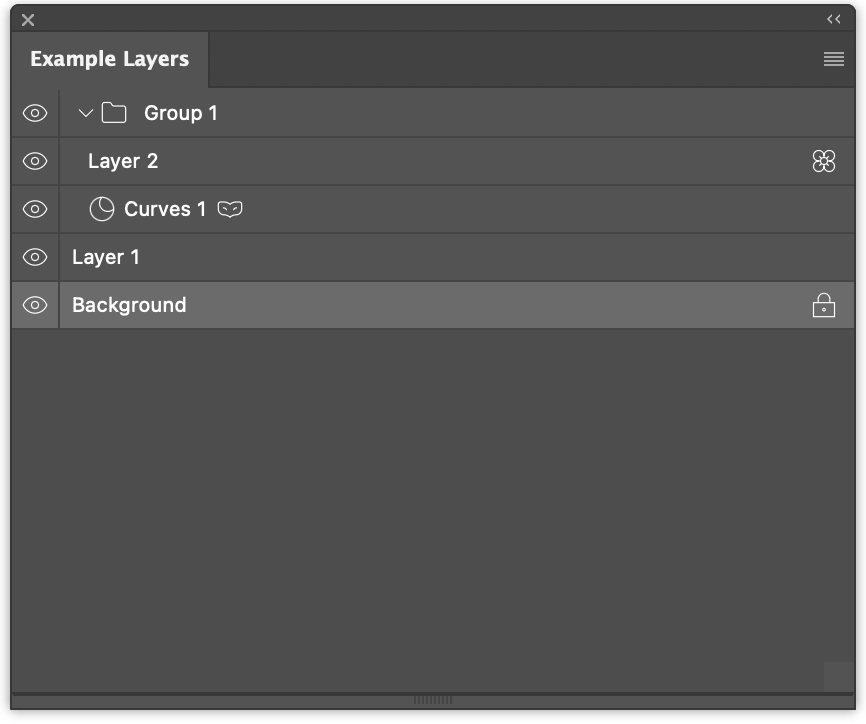

# Example Layers Plugin

Recreation of the layers panel using UXP and @bubblydoo/uxp-toolkit.

See [main.tsx](./src/main.tsx) for the source code. It's a showcase of the capabilities of using UXP Toolkit with React Query.

Downloadable via [Adobe Exchange](https://exchange.adobe.com/apps/cc/ea305a81/uxp-toolkit-example-layers-plugin).

Tailwind is stuck at v3 because v4 is not really compatible with UXP.

